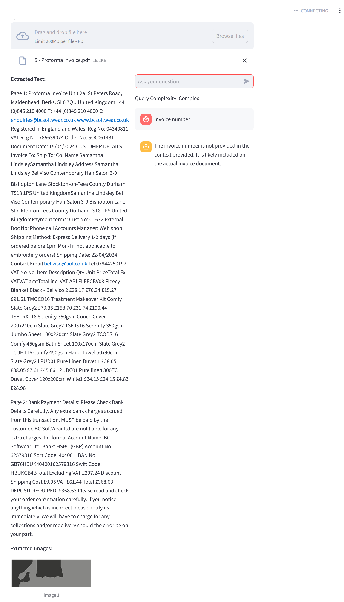

# Adaptive RAG Project

This project implements an Adaptive Retrieval-Augmented Generation (RAG) system that dynamically adjusts retrieval strategies based on query complexity.

## Features:
- Upload PDFs and extract both text and images.
- Determine query complexity (simple or complex) and adapt the retrieval strategy accordingly.
- Interactive chat interface to communicate with the system and get responses.
- Seamless integration with OpenAI API to generate answers based on the user's query and the context provided by the uploaded documents.

## Setup

1. **Install dependencies**:
   - Clone the repository and navigate to the project directory.
   - Install the necessary dependencies by running the following command:
     ```bash
     pip install -r requirements.txt
     ```

2. **Add your OpenAI API key**:
   - Create a `.env` file in the root directory.
   - Add your OpenAI API key to the `.env` file:
     ```
     OPENAI_API_KEY=your-openai-api-key-here
     ```

3. **Run the app**:
   - Start the Streamlit app with the following command:
     ```bash
     streamlit run src/adaptive_rag.py
     ```

   - This will launch the application in your web browser.

## Usage
1. **Upload a PDF file**:  
   After running the app, you'll be able to upload a PDF file. The system will extract both text and images from the document and display them.

2. **Ask your query**:  
   Use the chat input interface to ask a question. The system will process the query and dynamically determine if it's simple or complex, adjusting the retrieval strategy accordingly.

3. **View the response**:  
   The system will respond to your query in the chat interface. Responses are tailored based on the complexity of the query.

## Screenshots

Here are some example screenshots of the Adaptive RAG system in action:

### 1. **Uploading PDF and Extracting Content**
   
   *This screen shows the PDF upload interface and the extracted content preview, including text and images.*

### 2. **Chat Interface for Asking Queries**
   
   *Here you can see the chat interface where users can interact with the system and get responses.*

### 3. **LLM Response Based on Query Complexity**
   
   *The response from the system after processing a user's query, showing the dynamic response generation.*

## License
This project is licensed under the MIT License - see the [LICENSE](LICENSE) file for details.
